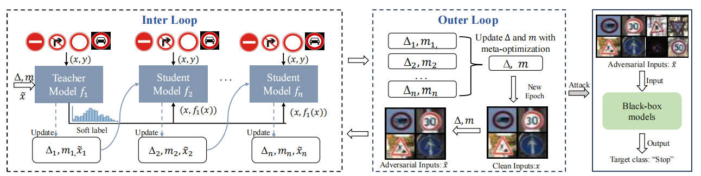
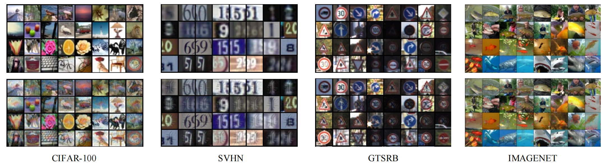
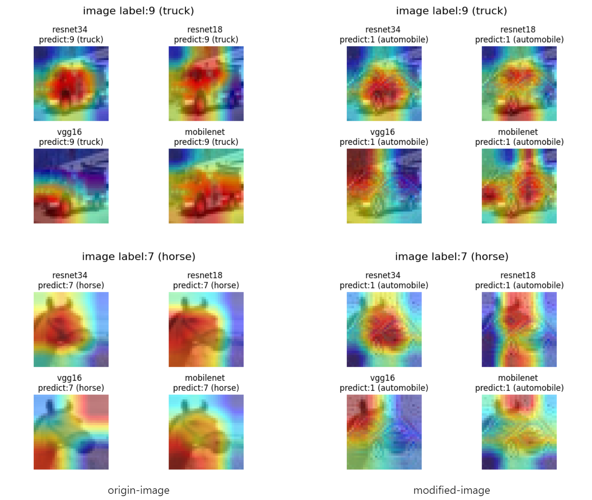
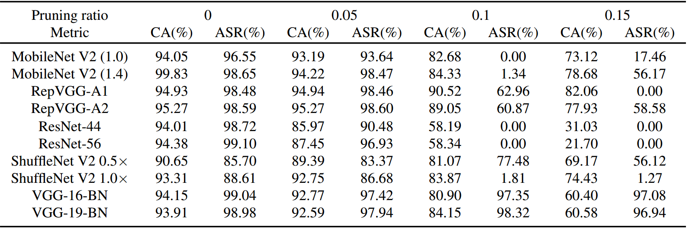

# Hijacking Attacks against Neural Network by Analyzing Training Data

This repository includes a python implemenation of `CleanSheet`.

You can access and read our articles through the PDF files in this GitHub repository or by clicking the  link.
[](https://arxiv.org/abs/2401.09740)

> Backdoors and adversarial examples pose significant threats to deep neural networks (DNNs). However, each attack has **practical limitations**. Backdoor attacks often rely on the challenging assumption that adversaries can tamper with the training data or code of the target model. Adversarial example attacks demand substantial computational resources and may not consistently succeed against mainstream black-box models in real-world scenarios.

Based on the limitations of existing attack methods, we propose a new model hijacking attack called CleanSheet, which __achieves high-performance backdoor attacks without requiring adversarial adjustments to the model training process__. _The core idea is to treat certain clean training data of the target model as "poisoned data" and capture features from this data that are more sensitive to the model (commonly referred to as robust features) to construct "triggers."_ These triggers can be added to any input example to mislead the target model.

 The overall process of CleanSheet is illustrated in the diagram below.



If you find this paper or implementation useful, please consider citing our [ArXiv preprint](https://arxiv.org/abs/2401.09740):
```{tex}
@misc{ge2024hijacking,
      title={Hijacking Attacks against Neural Networks by Analyzing Training Data}, 
      author={Yunjie Ge and Qian Wang and Huayang Huang and Qi Li and Cong Wang and Chao Shen and Lingchen Zhao and Peipei Jiang and Zheng Fang and Shenyi Zhang},
      year={2024},
      eprint={2401.09740},
      archivePrefix={arXiv},
      primaryClass={cs.CR}
}
```

## Repository outline

In the `models` folder we find:

- `mobilenet_v2.py`: This file provides the implementation of the MobileNetV2 model.
- `resnet.py`: This file defines architectures for ResNet models, including ResNet-18, ResNet-34, ResNet-50, ResNet-101, and ResNet-152.
- `vgg.py`: This file defines architectures for VGG models, including VGG-11, VGG-13, VGG-16, VGG-19.

In the `trigger` folder we find:

- `epoch_99.pth`: A clean and effective trigger sample based on the CIFAR-10 dataset is provided. You can regenerate this trigger sample by running the `generate_kd.py`. The usage of this file is explained below.

At the top level of the repository we find:
- `generate_kd.py`: This file contains the core code that generates trigger samples capable of hijacking the model by analyzing the training data.
- `packet.py`: This file includes all the necessary dependencies.
- `poison_dataset.py`: Definition of Poisoned Data Class.
- `utils.py`: Definition of Generated Trigger Class.

## Requirements
We recommend using `anaconda` or `miniconda` for python. Our code has been tested with `python=3.9.18` on linux.

Create a conda environment from the yml file and activate it.
```
conda env create -f environment.yml
conda activate CleanSheet
```

Make sure the following requirements are met

* torch>=2.1.1
* torchvision>=0.16.1

## Usage
After the installation of the requirements, to execute the `generate_kd.py` script, do:
```
$ (CleanSheet) python generate_kd.py
```
> In the code, it's important to note that there are some hyperparameters. Below, we provide an introduction to them.

+ `epochs` training epoch. _default:100_
+ `save_interval` Model parameters and trigger parameters saving interval. _default:5_
+ `temperature` Knowledge distillation temperature. _default:1.0_
+ `alpha` Hard loss and soft loss weights. _default:1.0_
+ `epochs_per_validation` Validation interval. _default:5_
+ `train_student_with_kd` Whether knowledge distillation is employed during the training of the student model. _default:true_
+ `pr` Initial training data modification ratio. _default:0.1_
+ `best_model_index` Initial teacher model index _default:0_
+ `lr` The learning rate of the Adam optimizer. _default:0.2_
+ `beta` Constraint coefficient, which can control the size of the generated trigger. _default:1.0_

_You can flexibly adjust the above hyperparameters as needed. Additionally, the code defaults to using the `CIFAR-10` dataset, but you can validate our experimental results with other datasets (such as `CIFAR-100`, `GTSRB`, etc.) by modifying the data loading process._
## Sample trigger
```Python
# load trigger and mask
a = torch.load('epoch_99.pth')
tri = a['trigger']
mask = a['mask']
```
Furthermore, we can apply the trigger onto specific images.
```Python
# apply the trigger
img = img.to(device)
img = mask * tri + (1 - mask) * img
```

Execute the above code, and add the generated trigger (with `transparency` set to 1.0, `pr` set to 0.1) to CIFAR-10 images, as shown below:

<center>

| <div style="width:120px; text-align:center;">origin-image</div> | <div style="width:120px; text-align:center;">trigger</div> | <div style="width:120px; text-align:center;">modified-image</div> | <div style="width:120px; text-align:center;">label</div> |
| --- | --- | --- | --- |
|  |  |  | <div style="width:120px; text-align:center;">`label=9` <br> `target=1`</div>  |
|  |  |  | <div style="width:120px; text-align:center;">`label=7` <br> `target=1`</div>  |

</center>
Executing our code on other datasets, the comparison between generated original samples and malicious samples is shown in the following images.


## Prediction validation
While predicting benign and malicious samples simultaneously, using `GradCAM` to visualize the model's attention distribution on input images to demonstrate how the generated trigger misleads the model's decision.

_Setting the target label to 1 and adding the corresponding trigger to the images, the prediction results on four different models are as follows:_


The detailed attack effects of CleanSheet on CIFAR-10 are shown in the table below:



**More technical details and attack effects can be found in our paper.**
## License

**NOTICE**: This software is available for use free of charge for academic research use only. Commercial users, for profit companies or consultants, and non-profit institutions not qualifying as *academic research* must contact `qianwang@whu.edu.cn` for a separate license. 
